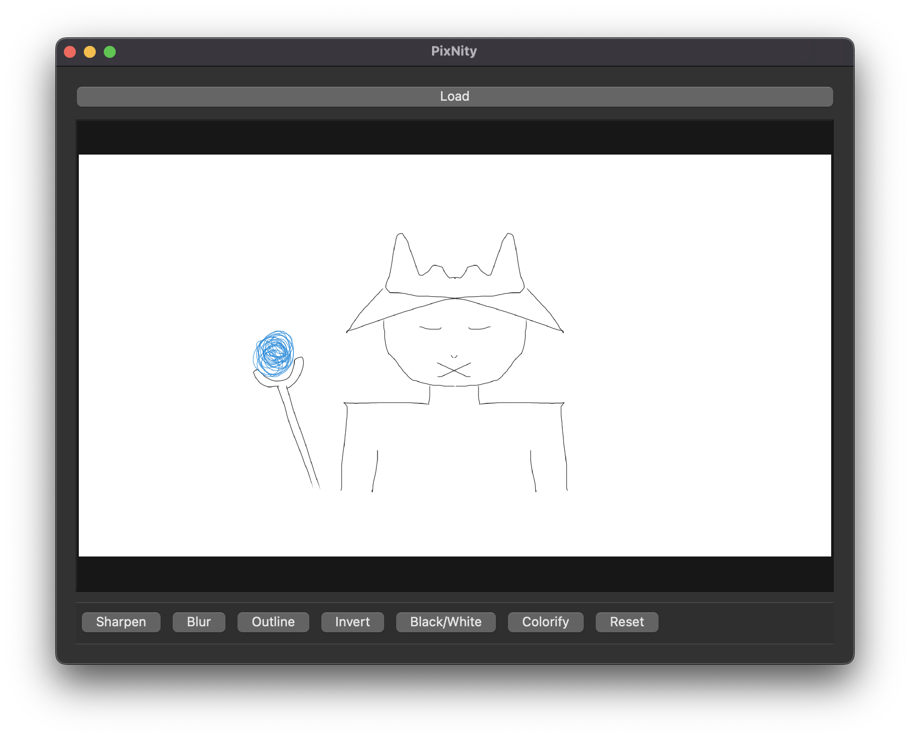

# PixNity 🎨

PixNity is a lightweight and intuitive desktop application for image processing, built using **PyQt6** and **OpenCV**. It offers a set of interactive filters and effects that can be applied in real-time with an easy-to-use GUI.

## ✨ Features

- 🖼️ **Image Viewer** with zoom, drag, and fit-to-view
- 🔍 **Sharpen** and **Blur** using custom convolution kernels
- ✏️ **Outline detection** using Sobel edge filters
- 🎭 **Invert** colors with one click
- ⚫ **Black & White Thresholding** with customizable intensity
- 🌈 **Colorify / Quantization** for stylized effects
- 🔄 **Reset** to revert changes to the original image

## 🧰 Tech Stack

- **Python 3**
- **OpenCV** for image processing
- **PyQt6** for GUI framework
- **NumPy** for matrix operations

## 📸 Screenshot



## 🚀 Getting Started

### 1. Clone the repo

```bash
git clone https://github.com/dsangule/PixNity.git
cd pixnity
```

### 2. Install Dependencies

Make sure you have Python 3.8+ installed. Then run:
```bash
pip install -r requirements.txt
```

### 3. Run the Application
```bash
python app.py
```

## 🖱️ Usage
- Click Load to open any image (.jpg, .png, .bmp, etc.)
- Use the toolbar to:
    - Apply image filters like Sharpen, Blur, Invert
    - Use Outline for edge detection
    - Convert to Black/White with a user-defined threshold
    - Colorify to reduce color complexity and stylize the image
    - Hit Reset to go back to the original

## 📂 File Structure
```
pixnity/
├── app.py
├── README.md
└── requirements.txt
```